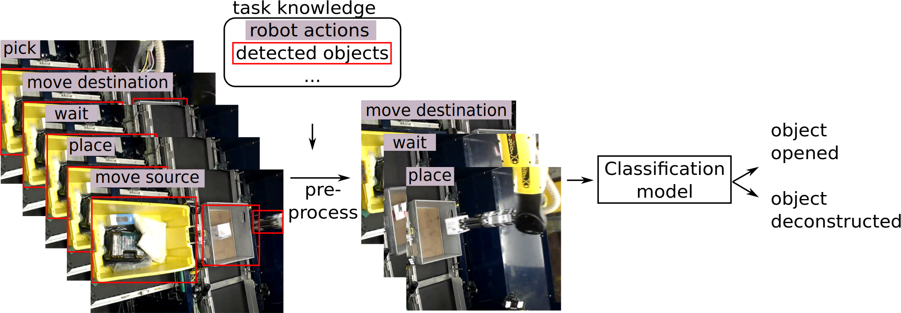

# Enhancing Video-Based Robot Failure Detection Using Task Knowledge

[<a href="https://sthoduka.github.io/using_task_knowledge/">Website</a>] 
[<a href="https://zenodo.org/records/15873769">Dataset</a>]
[<a href="https://arxiv.org/abs/2508.18705">Paper</a>]

This repository contains the code accompanying the paper "Enhancing Video-Based Robot Failure Detection Using Task Knowledge" to appear at the <a href="https://ecmr2025.dei.unipd.it/">European Conference on Mobile Robots 2025</a>. We propose to make use of task knowledge to improve performance of video-based robot failure detection. We use the temporal boundaries of the robot’s actions and the location of task-relevant objects to guide frame selection and pre-processing before using a video-classification model for failure detection.



## Train and Test
Install the requirements using `pip install -r requirements.txt`

### ARMBench

The MViT checkpoint can be found [here](https://github.com/facebookresearch/SlowFast/blob/main/MODEL_ZOO.md) ("Kinetics/MVIT_B_32x3_CONV_K600").

We train the baseline for 5 epochs, and load that checkpoint using the `partial_ckpt` argument and train all models (including the baseline) for another 10 epochs. Alternatively, you could just train your model for 15 epochs to get similar results.

The following command will run the training and test script for the baseline model:
```
python main.py \
  --data_root=/path/to/armbench-defects-video-0.1/ \
  --dataset=armbench_video \
  --training_trials=/path/to/armbench-defects-video-0.1/train.json \
  --val_trials=/path/to/armbench-defects-video-0.1/test_subset.json \
  --test_trials=/path/to/armbench-defects-video-0.1/test.json \
  --mvit_config=configs/MVIT_B_32x3_CONV.yaml \
  --mvit_ckpt=/path/to/k600.pyth \
  --batch_size=1 \
  --accumulate_grad_batches=16 \
  --n_threads=16 \
  --learning_rate=0.00003 \
  --max_epochs=10 \
  --enable_progress_bar \
  --partial_ckpt=/path/to/previous_ckpt/last.ckpt \
  --log_dir=logs

```
Add/replace the following options for the different variants mentioned in the paper:

* Action Subset:
    ```
    --action_subset_frame_selection
    ```

* Action-based Crop:
    ```
    --action_crop
    ```
* Action-aligned FPS augmentation
    ```
    --action_aligned_fps_aug
    ```
* Random FPS augmentation
    ```
    --non_action_aligned_fps_aug
    ```
* Treat each action as a separate sample
    ```
    --actions_separately
    ```
* Image Pair Model
    ```
    --dataset=armbench_img_pair
    ```

### FAILURE
```
python main.py \
  --data_root=/path/to/finonet/ \
  --dataset=failure_video \
  --num_classes=2 \
  --mvit_config=configs/MVIT_B_32x3_CONV.yaml \
  --mvit_ckpt=/path/to/k600.pyth \
  --batch_size=1 \
  --accumulate_grad_batches=16 \
  --n_threads=16 \
  --learning_rate=0.0001 \
  --max_epochs=50 \
  --enable_progress_bar \
  --log_dir=logs \
```

* Action-aligned FPS augmentation
    ```
    --action_aligned_fps_aug
    ```

* Image Pair Model
    ```
    --dataset=failure_img_pair
    ```

### (Im)PerfectPour
```
python main.py \
  --data_root=/path/to/ImperfectPour/ \
  --dataset=imperfect_pour \
  --num_classes=2 \
  --mvit_config=configs/MVIT_B_32x3_CONV.yaml \
  --mvit_ckpt=/path/to/k600.pyth \
  --batch_size=1 \
  --accumulate_grad_batches=16 \
  --n_threads=16 \
  --learning_rate=0.0001 \
  --max_epochs=50 \
  --enable_progress_bar \
  --log_dir=logs \
```

* Action-aligned FPS augmentation
    ```
    --action_aligned_fps_aug
    ```

* Image Pair Model
    ```
    --dataset=imperfect_pour_img_pair
    ```
